<div align="center">

```
████████████████████████████████████████████████████████████████
█                                                              █
█                  S Y N T H W A V E   R U N N E R            █
█                                                              █
████████████████████████████████████████████████████████████████
    ___                                              ___
   /   \          SCORE: ∞                          /   \
  /  ●  \         HI: 999999                       /  ●  \
 /_______\                                        /_______\
                          __
                         / _)     
                  .-^^^-/ /       [PRESS SPACE]
           __    /      /
          /  \__/       /         
         /              \
    ~~~~~~~~~~~~~~~~~~~~~~~~~~~~~~~~~~~~~~~~~~~~~~~~~~~~~~~~
```


```
━━━━━━━━━━━━━━━━━━━━━━━━━━━━━━━━━━━━━━━━━━━━━━━━━━━━━━━━━━━━
```

</div>

---

## 🦖 PLAYER STATS

```
╔═══════════════════════════════════════════════════════════╗
║                                                           ║
║  NAME ........... Satrajit Ghosh                         ║
║  CLASS .......... MS ECE (Machine Learning)              ║
║  GUILD .......... Rutgers University                     ║
║  LEVEL .......... 4.0 / 4.0 GPA                          ║
║  SPEC ........... Graphics│GPU│VR/AR                     ║
║  ENGINE ......... LAGEngine (C++/OpenGL/CUDA)            ║
║                                                           ║
╚═══════════════════════════════════════════════════════════╝
```

---

## 🎮 SKILL TREE

<table>
<tr>
<td width="50%">

```
███ GRAPHICS PROGRAMMING ███

████████████ C++ / OpenGL
████████████ GLSL / Shaders
███████████░ CUDA Compute
██████████░░ Vulkan / DX
████████████ Physics Sim
```

</td>
<td width="50%">

```
███ ML / 3D VISION ███

███████████░ PyTorch
███████████░ NeRF / 3DGS
██████████░░ Neural Render
███████████░ Scene Recon
█████████░░░ Multimodal
```

</td>
</tr>
</table>

<div align="center">

### ⚡ EQUIPPED ITEMS

`[C++20]` `[CUDA 12.x]` `[OpenGL 4.6]` `[Python]` `[JavaScript]` `[GLSL]` `[CMake]` `[Git]` `[RenderDoc]` `[NSight]` `[Docker]` `[Linux]`

</div>

---

## 🌃 ACTIVE QUESTS

### 🎯 MAIN QUEST: LAGEngine

```
┏━━━━━━━━━━━━━━━━━━━━━━━━━━━━━━━━━━━━━━━━━━━━━━━━━━━━━━━┓
┃  🦖 CUSTOM GAME ENGINE & RESEARCH TESTBED              ┃
┣━━━━━━━━━━━━━━━━━━━━━━━━━━━━━━━━━━━━━━━━━━━━━━━━━━━━━━━┫
┃                                                         ┃
┃  ▶ DAG-based render graph                              ┃
┃  ▶ Multithreaded work-stealing scheduler               ┃
┃  ▶ CUDA–OpenGL interop magic                           ┃
┃  ▶ Real-time perf instrumentation                      ┃
┃  ▶ Frame time / GPU utilization tracking               ┃
┃                                                         ┃
┃  STATUS: [████████████████░░░░] 80% COMPLETE           ┃
┗━━━━━━━━━━━━━━━━━━━━━━━━━━━━━━━━━━━━━━━━━━━━━━━━━━━━━━━┛
```

### 🥽 SIDE QUEST: VR/AR Systems

```
╔═══════════════════════════════════════════════════════╗
║                                                       ║
║  🏆 VR Fitness Game                                  ║
║     └─ 3rd Place @ Google × GeeksforGeeks           ║
║        "Solving for India" Competition               ║
║                                                       ║
║  🏭 VR Warehouse Training                            ║
║     └─ Interactive learning modules                  ║
║                                                       ║
║  🏠 VR Architectural Tours                           ║
║     └─ Real-time client walkthroughs                ║
║                                                       ║
║  🎬 VR Movie Theatre                                 ║
║     └─ Lockdown entertainment solution               ║
║                                                       ║
╚═══════════════════════════════════════════════════════╝
```

### 🧪 SPECIAL EVENT: Neural Rendering [Princeton Exchange]

```
▀▀▀▀▀▀▀▀▀▀▀▀▀▀▀▀▀▀▀▀▀▀▀▀▀▀▀▀▀▀▀▀▀▀▀▀▀▀▀▀▀▀▀▀▀▀▀▀▀▀▀
  ◆ Neural Radiance Fields (NeRF)
  ◆ 3D Gaussian Splatting  
  ◆ Neural Scene Reconstruction
  ◆ Animatable 3D Avatars
▀▀▀▀▀▀▀▀▀▀▀▀▀▀▀▀▀▀▀▀▀▀▀▀▀▀▀▀▀▀▀▀▀▀▀▀▀▀▀▀▀▀▀▀▀▀▀▀▀▀▀
```

### 🔬 DAILY CHALLENGES

- **McGurk Effect Studies** → Audiovisual perception in deep models
- **Quant Trading Tools** → Signal processing & backtesting automation

---

## 📊 GAME STATS

<div align="center">




</div>

---

## 🎯 ACHIEVEMENTS UNLOCKED

<div align="center">

```
┏━━━━━━━━━━━━━━━┳━━━━━━━━━━━━━━━┳━━━━━━━━━━━━━━━┓
┃   🏆 4.0 GPA   ┃  ⚡ 60 FPS    ┃  🎮 ENGINE    ┃
┃   MAINTAINED   ┃   SUSTAINED   ┃   ARCHITECT   ┃
┗━━━━━━━━━━━━━━━┻━━━━━━━━━━━━━━━┻━━━━━━━━━━━━━━━┛

┏━━━━━━━━━━━━━━━┳━━━━━━━━━━━━━━━┳━━━━━━━━━━━━━━━┓
┃  🥉 GOOGLE    ┃  🧠 NEURAL    ┃  🎨 RENDER    ┃
┃   CHALLENGE   ┃   RENDERING   ┃   PIPELINE    ┃
┗━━━━━━━━━━━━━━━┻━━━━━━━━━━━━━━━┻━━━━━━━━━━━━━━━┛
```

</div>

---

## 🌆 PERFORMANCE METRICS

<div align="center">

```
╔═══════════════════════════════════════════════════════╗
║                                                       ║
║  ⚡ FRAME TIME ............. < 16.67ms (60 FPS)      ║
║  🎮 GPU UTILIZATION ........ 95%+                    ║
║  🔥 DRAW CALLS ............. Batched & Optimized     ║
║  💾 MEMORY BANDWIDTH ....... Max via Interop         ║
║  ✨ CODE QUALITY ........... Production-Grade        ║
║                                                       ║
╚═══════════════════════════════════════════════════════╝
```

</div>

---

## 📡 CONNECT TO SERVER

<div align="center">

[](mailto:sg2231@rutgers.edu)
[](https://www.linkedin.com/in/satrajit-ghosh/)
[](https://github.com/satrajitghosh183)

<br>

```
┏━━━━━━━━━━━━━━━━━━━━━━━━━━━━━━━━━━━━━━━━━━━━━━━━━━━━━━━┓
┃  "Measure honestly. Build iteratively. Tune by data." ┃
┗━━━━━━━━━━━━━━━━━━━━━━━━━━━━━━━━━━━━━━━━━━━━━━━━━━━━━━━┛
```


### ⚡ POWERED BY: C++20 • OpenGL 4.6 • CUDA 12.x • Real-Time Passion ⚡

```
━━━━━━━━━━━━━━━━━━━━━━━━━━━━━━━━━━━━━━━━━━━━━━━━━━━━━━━━━━━━
```

</div>

```
                                                   
   🦖 ────────────────────────────────────────► 🏁
                                                   
```

</div>
